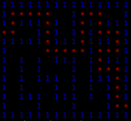

# Maze Solver

A C++ program that reads a maze from a text file, finds a path from start to finish using iterative stack-based backtracking, and prints the solved maze to the terminal with the path highlighted in color.



## How it works

1. **Parse** — The maze is read line by line into a 2D grid of integers, where `0` is open space and `1` is a wall.
2. **Detect entry and exit** — The border of the grid is scanned for openings (cells with value `0`). The first and last openings found become the start and target cells, so the user never has to specify them.
3. **Search** — A stack tracks the current path. At each step, the algorithm checks neighbors in a fixed order — **down, right, up, left** — and steps into the first one that's in bounds, unvisited, and open. When a dead end is hit, the top of the stack is popped and the search continues from the previous cell. The loop ends when the target is on top of the stack or the stack empties.
4. **Render** — The solved maze is printed with ANSI color codes: the solution path in red (`*`), walls in blue (`1`), and open cells as blank space.

## Build and run

```bash
g++ -std=c++20 main.cpp Maze.cpp -o maze
./maze maze0-1_input.txt
```

On Windows, replace the run command with `.\maze.exe maze0-1_input.txt`.

## Input format

A plain text file where each line is a row of the maze, written as a string of `0`s and `1`s with no separators. Example:

```
111111111111111
100000001000001
101110101010111
000010101010001
111111111011101
```

Openings on the border are treated as the entry and exit. If no path exists, the program prints `No solution is possible.`
